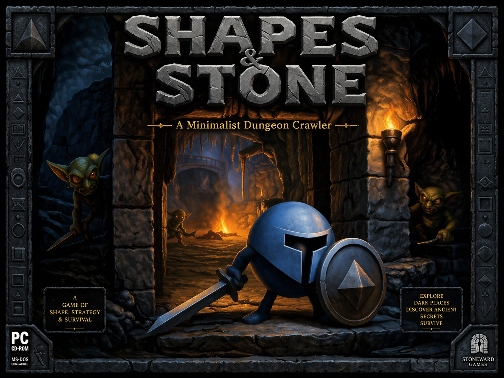

# SHAPES & STONE

*A Minimalist Dungeon Crawler*



---

## CONCEPT

A 2D top-down dungeon crawler where atmosphere triumphs over graphical complexity. Players navigate procedurally generated dungeons as geometric shapes — square knights, circular sorcerers, triangular hunters — fighting through stone corridors filled with danger and discovery. Simple visuals allow a solo developer to focus on tight gameplay, immersive audio, and satisfying progression. The world is built from basic primitives: axis-aligned rectangles form the walls, color sets the mood, particles bring it to life.

**Target:** PC (Steam), 15-30 min runs, multiplayer-ready architecture  
**Inspiration:** Ultima Underworld, Diablo, VVVVVV, Thomas Was Alone

---

## DESIGN PILLARS

1. **Geometric Clarity** — Shapes convey meaning instantly. No sprite ambiguity.
2. **Atmosphere First** — Color, particles, sound, and music create tension and wonder.
3. **Solo-Dev Scope** — Every feature must be achievable by one person in reasonable time.
4. **Classical Fantasy** — Proven mechanics, no reinvention. Comfort food for dungeon crawlers.
5. **Multiplayer-Ready** — Architecture supports co-op expansion later.

---

## PLAYABLE CLASSES

| Class | Shape / Color | Playstyle | Core Mechanic |
|-------|---------------|-----------|---------------|
| **KNIGHT** | Square / Steel Blue | Tank, melee-focused, slow but powerful | Shield bash stuns; block reduces damage |
| **SORCERER** | Circle / Violet | Glass cannon, area spells, mana management | Overcharge spells for power at health cost |
| **HUNTER** | Triangle / Forest Green | Fast, ranged, hit-and-run tactics | Dash leaves traps; headshots crit |

---

## DUNGEON STRUCTURE

Dungeons are small, procedurally generated, and persistent within a run. They follow a rhythmic pattern:

**Danger → Rest → Danger → Rest → Boss**

- **Danger Zones:** Stone corridors, enemies, traps, loot. Warm color palette (amber, crimson). Tense music, distant growls, flickering torchlight particles.
- **Rest Zones:** Safe havens. Cool color palette (soft blue, green glow). Calm ambient music, crackling fire sounds, floating ember particles.

**Rest Zone Features:**

- **Campfire** — Restore health, save progress, moment of peace
- **Wandering Vendor** — Spend gold on potions, gear, upgrades
- **Lore Stones** — Optional story fragments, world-building

This rhythm creates tension and release — players push through danger knowing safety awaits.

---

## CORE MECHANICS

All mechanics are intentionally classical and proven:

**Resources:**

- **Health** — Don't reach zero. Simple.
- **Mana** — Powers abilities. Regenerates slowly or via potions.
- **Gold** — Dropped by enemies, found in chests. Spent at vendors.

**Items:**

- **Health Potions** — Instant heal, limited carry capacity
- **Mana Potions** — Instant restore, limited carry capacity
- **Gear** — Weapons and armor with simple stat boosts (damage, defense, speed)

**Progression:**

- **Within a run:** Get stronger through loot and vendor purchases
- **Between runs:** Unlock new starting options, cosmetic shapes, story chapters

---

### IDEA: Per-Class Resource Systems (Stamina)

> **Status:** Design idea, not yet implemented. Captured for future reference.

The Knight uses **cooldown-based** combat: each action (attack, dash) has a fixed recovery time. This creates a natural attack-recover rhythm without requiring resource management. Adding a stamina bar on top would double-gate every action (cooldown AND stamina cost), which feels restrictive without adding meaningful decisions.

However, stamina could define a **future class's identity**:

| Class | Core Resource | Feel |
|-------|--------------|------|
| **Knight** | Cooldowns | Steady, reliable, patient — you wait for your opening |
| **Hunter** | Stamina | Fast, risky — many quick actions but exhaust quickly |
| **Sorcerer** | Mana | Powerful bursts — manage a finite pool, high impact per cast |

Each class would feel fundamentally different not just in abilities but in *how you think about spending your actions*. The Knight never worries about running dry — the question is timing. The Hunter can do everything fast but must rest. The Sorcerer hits hard but every spell is a commitment.

**Design principle:** Don't add stamina to a class that already has cooldowns. One action-limiting resource per class. The limiter IS the class identity.

---

## COMBAT SYSTEM

Deterministic damage with skill-based avoidance. No hit-chance RNG — every swing connects if in range. Skill expression comes from positioning, timing, and resource management.

### Combat Stats

| Stat | Purpose |
|------|---------|
| **HP** | Health points — reach zero, you die |
| **ATK** | Base damage dealt per hit |
| **DEF** | Flat damage reduction |
| **SPD** | Movement speed (% of base) |

### Damage Formula

```
final_damage = ATK - DEF + random(-1, +1)
minimum 1 damage (chip damage always possible)
```

**Blocking (Knight):**
```
blocked_damage = final_damage × 0.3  (70% reduction)
costs 5 mana/sec while held
```

### Stat Reference (Vertical Slice)

| Entity | HP | ATK | DEF | SPD |
|--------|-----|-----|-----|-----|
| Knight | 120 | 15 | 5 | 70% |
| Grunt | 20 | 10 | 2 | 80% |
| Dasher | 15 | 15 | 1 | 120% |
| Spitter | 12 | 8 | 0 | 60% |

### Attack Rhythm

Melee attacks have swing recovery (cooldown between attacks):

| Entity | Attack Cooldown | Notes |
|--------|-----------------|-------|
| Knight | 0.6s | Consistent, reliable |
| Grunt | 0.8s | Slow, telegraphed |
| Dasher | 1.5s | Long recovery after charge |
| Spitter | 1.2s | Ranged, keeps distance |

### Skill Expression (Non-Stat)

- **Positioning**: Use corridors and pillars, avoid getting surrounded
- **Timing**: Dodge during enemy telegraph, attack during recovery
- **Blocking**: Active decision — trade mana for damage reduction
- **Prioritization**: Choose targets wisely (Spitters first? Focus Dasher mid-charge?)

---

## COMBAT VISUAL FEEDBACK

All combat states communicated through shape transformation, color, and particles. No sprite animation needed.

### Attack Telegraph (Enemy Warning)

Enemies broadcast attacks before striking — the player's window to react.

| Phase | Duration | Visual |
|-------|----------|--------|
| Telegraph | 0.3s | Shrink to 80% + orange color pulse |
| Attack | 0.15s | Lunge toward target, shape stretches |
| Recovery | varies | Return to idle, vulnerable window |

### Attack Active (Melee Swing)

```
Before          During             After
  ■               ■▬→               ■
              (weapon rect extends)
```

- Shape stretches in attack direction (squash & stretch)
- Weapon shape: thin rectangle extends from entity
- Optional: translucent arc showing hit area
- Duration: 0.1-0.15s (snappy, responsive)

### Defend / Block (Knight)

```
Idle            Blocking
  ■               ▌■
              (shield rect appears,
               entity darkens,
               shield edge glows)
```

- Shield: thick rectangle on facing side
- Entity color: darkens 20% (braced stance)
- Shield edge: bright glow while active
- On hit while blocking: spark particles

### Damage Taken (Got Hit)

```
Frame 1-2       Frame 3-4        Frame 5+
  ■ ←hit          □               ■→
              (white flash)    (knockback)
```

| Effect | Detail |
|--------|--------|
| White flash | Entire shape → white for 2-3 frames (50ms) |
| Knockback | Push 0.25 tiles in hit direction |
| Squash | Brief compression toward hit |
| Particles | Small fragments burst from hit side |
| Screen shake | 2-3px for player hits |

### Stunned (After Shield Bash)

```
  ■ ∿∿
(wobble + star particles)
```

- Rotation oscillates ±5°
- Small diamond particles orbit entity
- Color slightly desaturated
- Duration: 1.5s (no actions possible)

### Death

```
■ → □ → ✦ · · ·
   flash  fragments scatter
```

- Final white flash
- Shape splits into 4-8 fragments (same color)
- Fragments scatter outward with physics, fade over 0.5s
- Gold drops spawn at death position

### Flash Color Reference

| Color | Hex | Meaning |
|-------|-----|---------|
| White | #FFFFFF | Damage taken |
| Orange | #FF8C00 | Attack telegraph |
| Steel Blue | #4A90A4 | Block successful |
| Red | #FF4444 | Critical / heavy hit |

---

## ATMOSPHERE TOOLKIT

This is the USP. Where other games have detailed sprites, we have mood.

| Layer | Implementation |
|-------|----------------|
| **Color** | Dynamic palette shifts: danger = warm (orange, red), safety = cool (blue, green). Fog of war in deep purple. |
| **Particles** | Dust motes in torchlight, spell trails, blood splatter, campfire embers, dripping water ripples |
| **Sound FX** | Footstep echoes that change by room size, distant enemy growls, dripping water, crackling flames, sword impacts |
| **Music** | Layered ambient tracks. Danger zones: low drones, rising tension. Rest zones: gentle, melodic, peaceful. Dynamic intensity based on combat state. |
| **Lighting** | Simulated via color gradients and particle glow. Torches cast warm circles. Magic glows. Darkness at the edges. |

---

## STORY APPROACH

Minimalist but evocative. Told through:

- **Lore Stones** in rest zones — short, poetic fragments
- **Environmental storytelling** — a broken sword, scattered gold, a shape that didn't make it
- **Vendor dialogue** — hints at the world, rumors of what lies deeper
- **Boss introductions** — brief, iconic moments before each major fight

The story unfolds across multiple runs. Death is part of the narrative. Why do shapes keep descending? What waits at the bottom? Keep it mysterious.

---

## MVP SCOPE (3-6 months solo)

- 3 playable classes with unique abilities
- 3 dungeon biomes (Crypt, Cavern, Abyss)
- 8-10 enemy types (geometric variety)
- Procedural room-based generation with danger/rest rhythm
- Health, mana, gold, potions, basic gear
- Vendor and campfire systems
- 1 boss per biome
- Full atmosphere pass (color, particles, sound, music)
- Story fragments and ending

---

## FUTURE: MULTIPLAYER EXPANSION

Architecture from day one supports:

- 2-4 player co-op
- Shared dungeon exploration
- Revive mechanics at campfires
- Class synergies (knight tanks, sorcerer damages, hunter scouts)

---

## THE PITCH

*Shapes & Stone* is a dungeon crawler stripped to its essence. No animation budget, no sprite work — just pure geometric clarity, rich atmosphere, and the timeless loop of fighting, looting, and descending deeper. It proves that mood beats fidelity, and that a square can be a hero.

---

---

# VERTICAL SLICE: "THE FIRST DESCENT"

This defines the first playable build — proof that the core loop works and feels good.

---

## GOAL

Deliver a complete, polished 5-10 minute gameplay experience that demonstrates:

- The Knight class is fun to play
- Dungeon generation creates interesting spaces
- The danger/rest rhythm works emotionally
- Atmosphere carries the visuals
- The loop is satisfying

If this vertical slice feels good, the rest is expansion.

---

## SCOPE

### One Class: The Knight

| Attribute | Value |
|-----------|-------|
| **Shape** | Square (axis-aligned, rotates slightly when moving) |
| **Color** | Steel Blue (#4A90A4) with subtle inner glow |
| **Size** | 32x32 units |
| **Speed** | Slow, deliberate (70% of base speed) |
| **Health** | 120 (highest of all classes) |
| **Mana** | 40 (lowest of all classes) |

**Abilities:**

| Input | Action | Cost | Description |
|-------|--------|------|-------------|
| **Primary (Click/Tap)** | Sword Swing | None | Short-range arc attack. 1.5 tile range. Hits all enemies in front. |
| **Secondary (Right Click/Hold)** | Shield Block | 5 mana/sec | Reduces incoming damage by 70%. Slows movement by 50%. Drains mana while held. |
| **Special (Space/Ability Button)** | Shield Bash | 20 mana | Dash forward 2 tiles. Stuns enemies hit for 1.5 seconds. 3 second cooldown. |

**Knight Fantasy:** You are the wall. You take hits so others don't have to. Slow, powerful, unstoppable.

---

### Dungeon Generator

**Structure:** Linear sequence of rooms connected by short corridors.

```
[START] → [DANGER] → [DANGER] → [REST] → [DANGER] → [DANGER] → [BOSS] → [END]
```

**Room Types:**

| Type | Size | Contents | Palette |
|------|------|----------|---------|
| **Start Room** | Small (7x7) | Player spawn, single torch, entry lore stone | Neutral gray, single warm light |
| **Danger Room** | Medium (10x10 to 14x14) | Enemies, obstacles, loot drops, occasional chest | Warm amber/crimson, flickering lights |
| **Rest Room** | Small (8x8) | Campfire, vendor, lore stone | Cool blue/green, steady gentle glow |
| **Boss Room** | Large (16x16) | Boss enemy, arena space, no obstacles | Deep red ambient, dramatic lighting |
| **Corridor** | Narrow (3 wide, 4-8 long) | Empty or single enemy | Dim, transitional lighting |

**Generation Rules:**

1. Rooms are axis-aligned rectangles (no diagonals, no curves)
2. Walls are 1-tile thick rectangles
3. One entrance, one exit per room (opposite walls preferred)
4. Danger rooms have 1-3 obstacles (rectangular pillars) for tactical play
5. Rest room always appears after exactly 2 danger rooms
6. Boss room is always final

**Procedural Variation:**

- Room dimensions vary within type constraints
- Obstacle placement randomized
- Enemy composition randomized (within budget)
- Loot placement randomized
- Torch/light placement randomized

---

### Enemies (Vertical Slice Set)

Three enemy types — enough for variety, simple enough for solo dev.

| Enemy | Shape | Color | Behavior | Health | Damage |
|-------|-------|-------|----------|--------|--------|
| **Grunt** | Small Square (16x16) | Dull Red (#8B3A3A) | Walks toward player, melee attack | 20 | 10 |
| **Dasher** | Small Triangle (16x16) | Orange (#D4763A) | Pauses, then dashes at player in straight line | 15 | 15 |
| **Spitter** | Small Circle (16x16) | Sickly Green (#6B8E4A) | Keeps distance, fires slow projectile | 12 | 8 per projectile |

**Enemy Spawning (per Danger Room):**

- Easy room: 2-3 Grunts
- Medium room: 2 Grunts + 1 Dasher OR 2 Grunts + 1 Spitter
- Hard room: 2 Grunts + 1 Dasher + 1 Spitter

**Enemy Behavior Principles:**

- Enemies telegraph attacks (color flash, brief pause, sound cue)
- Enemies have simple, readable patterns
- No enemy is unfair — death is always the player's mistake
- Enemies drop gold (100% chance) and occasionally health pickups (20% chance)

---

### Boss: The Hollow Warden

First boss. Guardian of the first descent. Tests mastery of blocking and timing.

| Attribute | Value |
|-----------|-------|
| **Shape** | Large Square (64x64) with rotating inner square |
| **Color** | Dark Iron (#2F3640) with pulsing red core |
| **Health** | 200 |
| **Phases** | 2 |

**Phase 1 (100%-50% HP):**

- **Slow Slam:** Telegraphs for 1 second (raises up), slams down dealing 30 damage in area. Blockable.
- **Summon:** Every 20 seconds, spawns 2 Grunts.

**Phase 2 (Below 50% HP):**

- Core turns bright red, movement speed increases by 30%
- **Charge:** Telegraphs for 0.5 seconds, charges across room. 25 damage. Must dodge, not block.
- **Slam** remains but faster telegraph (0.7 seconds)

**Victory:** Boss dissolves into particles. Exit opens. Gold shower. Triumphant music sting.

---

### Rest Zone: The Refuge

A single, hand-crafted rest room for the vertical slice (procedural rest rooms come later).

**Layout:**

```
 xxxxxxxxx
 x       x
 x  C    x
 x       x
 x V   L x
 x       x
 xxxxxxxxx

 C = Campfire (center)
 V = Vendor (left side)
 L = Lore Stone (right side)
```

**Campfire:**

- Interact to fully restore health
- One use per visit (replenishes if you leave and return — but why would you?)
- Particle effect: rising embers, warm glow
- Sound: crackling fire, peaceful ambience

**Vendor:**

- Shape: Friendly pentagon (unique shape = non-threat)
- Color: Warm gold (#C9A227)
- Inventory (Vertical Slice):

| Item | Cost | Effect |
|------|------|--------|
| Health Potion | 25 gold | Restore 40 HP (use anytime) |
| Mana Potion | 25 gold | Restore 30 Mana (use anytime) |
| Iron Shard | 75 gold | +10% damage for this run |
| Stone Heart | 75 gold | +20 max HP for this run |

- Dialogue (random selection):
  - "Shapes like you come through often. Few return."
  - "Gold means nothing down here. Take what you need."
  - "The Warden waits below. He was a knight once, they say."

**Lore Stone:**

- Shape: Thin vertical rectangle, slightly luminous
- Interact to read text:
  - *"We descended not for glory, but because the stones called us. They still call."*

---

### Core Loop (Vertical Slice Flow)

```
┌─────────────────────────────────────────────────────────────────────┐
│                         VERTICAL SLICE LOOP                         │
└─────────────────────────────────────────────────────────────────────┘

   ┌──────────┐
   │  START   │  Player spawns as Knight in Start Room
   └────┬─────┘  - Read opening lore stone (optional)
        │        - Single torch illuminates the space
        ▼
   ┌──────────┐
   │ DANGER 1 │  First combat encounter
   └────┬─────┘  - 2-3 Grunts (easy intro)
        │        - Learn: sword swing, basic movement
        │        - Collect: gold drops
        ▼
   ┌──────────┐
   │ DANGER 2 │  Escalation
   └────┬─────┘  - Grunts + 1 Dasher OR Spitter
        │        - Learn: blocking, timing, threat variety
        │        - Collect: gold, possible health drop
        ▼
   ┌──────────┐
   │   REST   │  The Refuge
   └────┬─────┘  - Campfire: heal fully
        │        - Vendor: spend gold on potions/upgrades
        │        - Lore Stone: world-building
        │        - EMOTIONAL BEAT: relief, preparation
        ▼
   ┌──────────┐
   │ DANGER 3 │  Harder combat
   └────┬─────┘  - Mixed enemy composition
        │        - Higher stakes (resources finite now)
        ▼
   ┌──────────┐
   │ DANGER 4 │  Pre-boss intensity
   └────┬─────┘  - Toughest normal encounter
        │        - Test player readiness
        ▼
   ┌──────────┐
   │   BOSS   │  The Hollow Warden
   └────┬─────┘  - Two-phase fight
        │        - Tests blocking, dodging, timing
        │        - Victory = massive gold + triumph
        ▼
   ┌──────────┐
   │   END    │  Vertical Slice complete
   └──────────┘  - "To be continued..." message
                 - Stats screen (time, damage taken, gold collected)
                 - Restart option
```

**Pacing Goals:**

| Segment | Duration | Emotional State |
|---------|----------|-----------------|
| Start | 30 sec | Curiosity, anticipation |
| Danger 1-2 | 2-3 min | Tension, learning, small victories |
| Rest | 1-2 min | Relief, planning, immersion |
| Danger 3-4 | 2-3 min | Stakes rising, resource pressure |
| Boss | 2-3 min | Peak tension, triumph or defeat |
| **Total** | **8-12 min** | Complete emotional arc |

---

### Controls (Keyboard + Mouse)

| Input | Action |
|-------|--------|
| WASD | Move |
| Mouse | Aim direction |
| Left Click | Primary attack (Sword Swing) |
| Right Click (Hold) | Secondary (Shield Block) |
| Space | Special (Shield Bash) |
| E | Interact (campfire, vendor, lore stone) |
| 1 | Use Health Potion |
| 2 | Use Mana Potion |
| ESC | Pause menu |

**Gamepad Support (Future):**

| Input | Action |
|-------|--------|
| Left Stick | Move |
| Right Stick | Aim |
| Right Trigger | Primary attack |
| Left Trigger | Shield Block |
| A / X | Special |
| B / Circle | Interact |
| D-Pad | Use potions |

---

### UI Elements (Vertical Slice)

Minimal, geometric, non-intrusive.

**HUD:**

```
┌────────────────────────────────────────────────────────────────┐
│ [■■■■■■■■░░] HP     [●●●●░░░░░░] MP          💰 150           │
│                                               [1]🧪 x3  [2]🧪 x2│
└────────────────────────────────────────────────────────────────┘
```

- Health bar: Steel blue, matches Knight color
- Mana bar: Soft violet
- Gold counter: Top right
- Potion slots: Bottom right with quantity

**Interaction Prompts:**

- Simple text appears above interactable objects: `[E] Rest` / `[E] Trade` / `[E] Read`

**Boss Health Bar:**

- Appears at bottom center during boss fight
- Shows boss name: "THE HOLLOW WARDEN"
- Large, dramatic, enemy-colored (dark red)

**Death Screen:**

```
        YOU HAVE FALLEN

        Rooms cleared: 4
        Gold collected: 127
        Time: 6:42

        [Try Again]   [Quit]
```

**Victory Screen:**

```
        DESCENT COMPLETE

        The Hollow Warden sleeps.
        But the stones still call...

        Rooms cleared: 6
        Gold collected: 243
        Time: 9:15

        [Continue] (grayed out - "Coming Soon")
        [Restart]
        [Quit]
```

---

### Technical Targets (Vertical Slice)

| Aspect | Target |
|--------|--------|
| **Resolution** | 1920x1080, 16:9 (scale down for smaller) |
| **Tile Size** | 32x32 base unit |
| **Frame Rate** | 60 FPS stable |
| **Camera** | Centered on player, slight lag/smoothing |
| **Collision** | Simple AABB (axis-aligned bounding boxes) |
| **Engine** | Developer's choice (Godot, Unity, Love2D all viable) |

---

### Audio List (Vertical Slice)

**Music:**

| Track | Usage | Mood |
|-------|-------|------|
| Ambient Danger | Danger rooms | Low drone, subtle tension, hints of melody |
| Ambient Rest | Rest room | Gentle, warm, peaceful, safe |
| Boss Theme | Hollow Warden fight | Driving rhythm, intensity, dramatic |
| Victory Sting | Boss defeated | Triumphant, brief (5-10 sec) |
| Death Sting | Player dies | Somber, brief (3-5 sec) |

**Sound Effects (Minimal Core):**

Diablo 1 principle: a few great sounds with pitch/volume variation beat many mediocre ones.

| Sound | Trigger | Variation | ElevenLabs Prompt |
|-------|---------|-----------|-------------------|
| **Impact** | All melee hits (player sword, enemy lunge) | Pitch-shift: low for heavy hits, high for light. Volume scales with damage. | *Short punchy impact, blade hitting stone armor, single crisp hit, dark fantasy, no reverb* |
| **Death burst** | Enemy killed (plays with particle explosion) | Randomize pitch ±10% per death | *Crystalline shatter, glass and stone breaking apart, short burst, fantasy game, satisfying crunch* |
| **Dash whoosh** | Player dash | None needed | *Fast short wind whoosh, quick dodge movement, snappy air burst, game sound effect* |
| **Dungeon ambient** | Background loop, always playing | None (single seamless loop) | *Dark underground ambience, slow water drips echoing in stone cavern, distant wind, eerie and empty, seamless loop, no music* |
| **Low HP pulse** | Player HP below 25%, repeating | Tempo increases as HP drops | *Deep slow heartbeat pulse, single beat, dark tension, low frequency thud, horror game* |

---

### Definition of Done (Vertical Slice)

The vertical slice is complete when:

- [ ] Knight is playable with all three abilities feeling responsive
- [ ] Dungeon generates a valid sequence every time (no broken rooms)
- [ ] All three enemy types behave correctly and are beatable
- [ ] Rest room provides functional campfire, vendor, and lore stone
- [ ] Hollow Warden boss is beatable and has both phases
- [ ] Health, mana, gold, and potions all work correctly
- [ ] Atmosphere is present: color palettes, particles, lighting
- [ ] Core audio is implemented: music tracks, essential SFX
- [ ] HUD displays all necessary information clearly
- [ ] Death and victory screens function
- [ ] One complete playthrough takes 8-12 minutes
- [ ] The loop feels satisfying to play repeatedly

---

### What's NOT in the Vertical Slice

Explicitly out of scope:

- Sorcerer and Hunter classes
- Multiple biomes (only "Crypt" aesthetic)
- Meta-progression between runs
- Save/load system
- Multiple bosses
- Procedural rest rooms
- Full story implementation
- Multiplayer
- Controller support (nice-to-have, not required)
- Settings menu (audio/video options)

