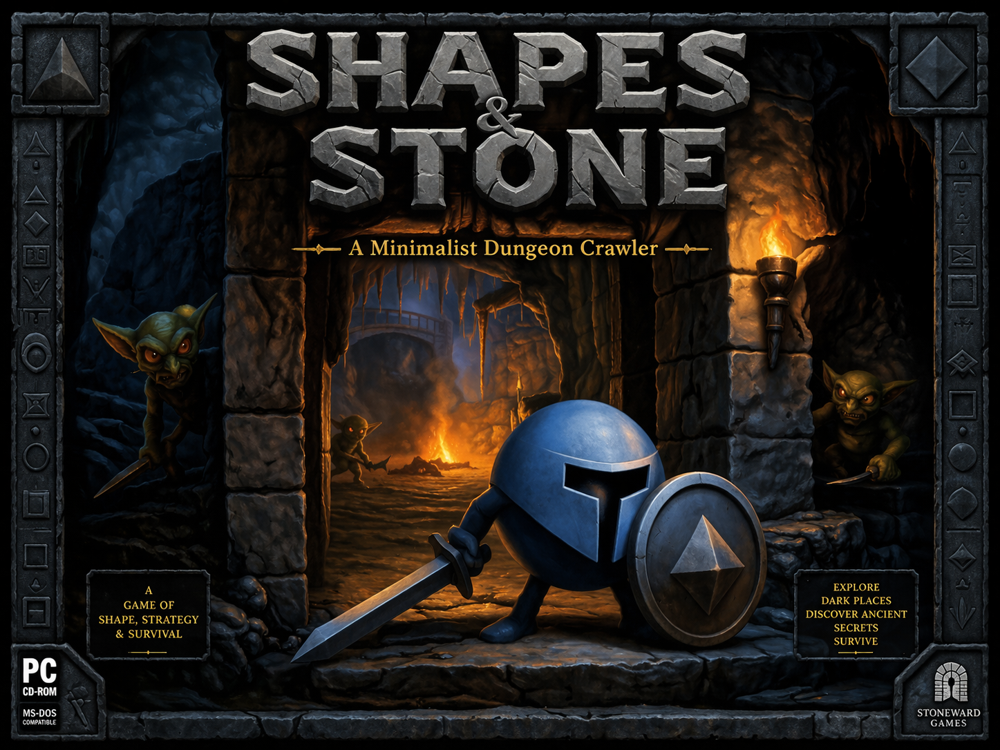

# SHAPES & STONE

*A Minimalist Dungeon Crawler*



---

## PLAY

The game comes as a download for macOS (Apple Silicon), Windows (64 bit) and
Linux (x86_64). Nothing else needs to be installed. The builds are not signed
by Apple or Microsoft, so the system asks once before it starts one.

**macOS:** unzip `ShapesAndStone-macos-arm64.zip` and move
`Shapes and Stone.app` where you like. On the first start macOS says it
cannot check the app: click *Done*, open *System Settings > Privacy &
Security*, scroll down to the message about "Shapes and Stone" and click
*Open Anyway*, then confirm with *Open*. From then on it starts like any app.

**Windows:** unzip `ShapesAndStone-windows-x64.zip` and start
`shapes_and_stone.exe` in the `Shapes and Stone` folder. If "Windows protected
your PC" appears, click *More info*, then *Run anyway*.

**Linux:** make the AppImage executable and start it:

```
chmod +x ShapesAndStone-linux-x86_64.AppImage
./ShapesAndStone-linux-x86_64.AppImage
```

It needs a system at least as new as Ubuntu 22.04, with OpenGL (on
Ubuntu, Debian: `libopengl0`). If it says it needs
FUSE, install `libfuse2` (Ubuntu, Debian:
`sudo apt install libfuse2`), or start it with `--appimage-extract-and-run`.

**Playing together over LAN:** all players are on the same network. One
player chooses *Multiplayer*, picks *LAN*, clicks *Host Game* and tells the
others the LAN code shown. Each of them chooses *Multiplayer*, types the code
and clicks *Join Game*; once everyone is listed, the host clicks *Start Game*.
The first time the host's game opens the network, macOS asks whether to
accept incoming connections and Windows asks to allow access through the
firewall: allow it (on Windows, for private networks), or the others cannot
join.

**In the browser:** open the game's GitHub Pages URL in a current browser;
nothing is installed. The first visit reloads the page once. In the
browser the lobby plays over the internet only: one player clicks *Host
Game* and tells the others the code shown, they type it and click *Join
Game*. A native game that hosts with *Internet* takes browser players too;
a LAN code does not work in the browser.

---

## BUILD

Clayground comes in as the git submodule `clayground/`; its commit is the
Clayground the game builds against.

```
git clone --recursive https://github.com/MisterGC/shapes-and-stone.git
cmake -S shapes-and-stone -B build -G Ninja -DCMAKE_PREFIX_PATH=<Qt>/6.11.1/macos
cmake --build build
```

In an existing clone, `git submodule update --init --recursive` fetches
Clayground.

To start the game headless and fail on any QML warning while it loads - the
check every PR runs (`.github/workflows/build.yml`):

```
ctest --test-dir build -R '^testshapes_and_stone$' --output-on-failure
```

Both knights, yours and the other player's, are drawn by `src/KnightView.qml`.
The knight bench puts the two side by side in the dungeon, makes them swing,
block, parry, get hurt, run their shields low and dry and dash at the same
moment, and saves a PNG per pose (`hurt`, `lowMana`, `shieldBreak`,
`charging`, `heavy`, `whirlwind`, and `sword` and `shield` for the smith's upgrades,
on the local knight only, among them). It needs a window: offscreen it saves
the HUD but not the world.

```
cp build/.qsb/src/shaders/*.qsb src/shaders/
qml -I build/bin/qml tests/knights/knights.qml -- <out dir>
```

The shaders are copied because the bench loads the QML from `src/`, not from
the resources. On macOS the `qml` from the Qt installer refuses the build's
ad-hoc signed plugins; a copy of it signed ad hoc (`codesign -s - --force`)
next to a `lib` link to Qt's `lib` loads them.

A hit shakes, kicks, flashes and hit-stops only the screen of the player who
landed or took it; the other screens draw its sparks and shards only. The
impact bench starts a host and a joiner in one process, joins them over LAN,
lands every kind of hit on each side, then a block alone and a perfect
block alone, then a real hit on the joiner's knight and its shield run
dry - the screen flash, the HP chunk and the mana bar's flash stay on the
joiner's screen, and the host draws the shards - and exits with the number
of failed checks:

```
QT_QPA_PLATFORM=offscreen qml -I build/bin/qml tests/impacts/impacts.qml
```

In a session the host runs every enemy: it spawns them as Clayground
replicated objects (`Network.spawn`, type `"enemy"`), runs their AI and
sends their position, AI state, HP and target. Every other screen shows
the host's enemies in the past by the delay Clayground sizes from the
jitter it sees (the interpolator's auto delay) and runs no AI of its
own. An enemy goes for the nearest knight still standing, on every screen
the same one. A knight's blow on an enemy is drawn and
counted on its own screen and applied by the host; an enemy's lunge or
shot is judged on the screen of the knight it goes for, by that knight's
shield, parry and dash as that screen has them, which applies the HP and
tells the others what became of it. A lunge's blow lands when that screen
shows the lunge land, so a parry there answers it; a shot carries the
host's id, and goes on every screen once the knight's screen has judged
it. The enemy bench
starts a host and a joiner in one process, joins them over LAN, puts a
knight at each of two enemies, compares every enemy on both screens for
five seconds (the joiner shows the parry ring of the host's enemies),
has one of the host's enemies wind up a crushing blow (the joiner shows
its `"crush"` state white-hot with the doubled ring, and its lunge with no
parry window) and the joiner's knight judge one on its held shield,
kills one from the joiner and lets the joiner's knight
fall, and exits with the number of failed checks:

```
QT_QPA_PLATFORM=offscreen qml -I build/bin/qml tests/enemies/enemies.qml
```

The same-world bench checks the same over the network, as a real session
has it: two processes of Clayground's live loader, a host and a joiner,
connected over Local (LAN) or Cloud signaling and started on a fixed seed.
The joiner's knight answers one of the host's enemies: it stands until the
enemy walks into its reach and swings, parries it, blocks, blocks
perfectly and dodges its lunges, blocks, dodges and takes a spitter's shots, shield-pushes it and
kills it while the host's knight kills another. Each answer counts once,
on both screens: the same HP, the stagger of a parry and of a perfect
block, the shove, the death and its
stain, a parried lunge that does not land, each lunge and shot judged by
the joiner's knight and reported to the host, and a shot that goes on the
host's screen when the report arrives. The enemy it answers winds up no
crushing blow: the answers are timed on its parry window, which a
crushing blow does not open. Then both knights fight for
eight seconds while each screen records every enemy it shows - its id, position,
HP and AI state - every frame. It exits with the number of failed checks;
`--fault stale` makes the joiner apply none of the host's enemy states, and
the run fails. It needs the live loader (`-DCLAYGROUND_WITH_TOOLS=ON`, see
the fight bench below):

```
python3 tests/sameworld/run_sameworld.py --mode local
python3 tests/sameworld/run_sameworld.py --mode cloud
```

`docs/multiplayer-sync.md` says what is compared and with what tolerance;
`--dump` and `--judge <file> --late-ms 200` show a joiner 200 ms late fail.

The game starts with its sound on, except in the dojo, and M mutes and
unmutes it. The sound bench starts the game the way a native build does,
enters the dungeon, presses M twice and exits with the number of failed
checks:

```
QT_QPA_PLATFORM=offscreen qml -I build/bin/qml tests/sound/sound.qml
```

At depth 0 a line at the bottom of the screen names the controls: WASD,
LMB strike (hold to charge), RMB shield, Shift dash, E talk, 1 potion, M
mute and Esc menu.
Esc opens a menu with Resume and Title. Alone it pauses the game: the
world stops, and its first step after Resume is one frame long, so nothing
of the pause is caught up (clayground#338). In a session it pauses nothing, since a host's pause
would stop every player's enemies: the menu says the party fights on and
only this knight stops taking input. Title leaves the run, and a session.
The pause bench checks the hint, the solo pause and its resume, and the
menu of a host and a joiner joined over LAN in one process, and exits with
the number of failed checks:

```
QT_QPA_PLATFORM=offscreen qml -I build/bin/qml tests/pause/pause.qml
```

At 0 HP the knight falls: the enemies stop and a screen shows how deep the
run got, counted in dungeons from depth 0. Enter starts a new run from depth
0 on a new seed, Esc returns to the title. The fall bench brings the knight
down twice, goes again with Enter and back to the title with Esc, and exits
with the number of failed checks:

```
QT_QPA_PLATFORM=offscreen qml -I build/bin/qml tests/fallen/fallen.qml
```

The title, the lobby, the pause menu and the fallen screen take the keys
while they are up, and the game takes them back when the last of them
closes: the knight answers the keys again without a click. A key held when
the menu opens is let go by Clayground's keyboard gamepad (clayground#413),
so the knight stands until it is pressed again. The focus bench sends every
key to whatever has the focus, closes each of these screens, checks that
the game holds the focus and holds D after it, and exits with the number
of failed checks:

```
QT_QPA_PLATFORM=offscreen qml -I build/bin/qml tests/focus/focus.qml
```

In a session a knight at 0 HP is down, drawn slumped and dark on every
screen, and the run goes on while another knight stands: the downed
player's screen says "You are down" and offers only Esc, which leaves the
session. When every knight is down the host ends the run: every screen
leaves the session and shows how far the party got, as the fall screen does
for one knight, and Enter or Esc goes to the title. The downed bench starts
a host and a joiner in one process, joins them over LAN, brings down first
one knight and then the other, twice in turn, and exits with the number of
failed checks. Between the two falls the host goes down two levels, and the
other screen must make the downed knight downed in each, not standing until
its next state:

```
QT_QPA_PLATFORM=offscreen qml -I build/bin/qml tests/downed/downed.qml
```

A session takes players in and lets them go while a run is under way. The
host keeps the run's seed and level as Clayground session properties, so a
player who joins late starts in the host's level, on its seed, with the
host's enemies as they are, and every screen draws the newcomer's knight.
A player who leaves is gone from every screen, and no enemy goes for its
knight any more. A joiner whose host leaves or goes silent is taken to the
title, which says so. The join and leave bench starts a host, a joiner and
a late joiner in one process, joins them over LAN, brings the joiner's knight
down and the host two levels deeper, lets the late joiner in, out again, and
then the host leave, and exits with the number of failed checks:

```
QT_QPA_PLATFORM=offscreen qml -I build/bin/qml tests/joinleave/joinleave.qml
```

A killed enemy drops gold where it fell, by its tier (`loot` in the balance
table); the fight room drops none. The first knight to reach a drop picks
it up, whoever dealt the killing blow, and the HUD shows "Gold N" under the
depth. In a session the host owns the drops as it owns the enemies: it
spawns each as a Clayground replicated object (type `"gold"`), a node
claims the drops its own knight reaches, and the host gives each to the
first claim it gets and despawns it, so a drop is picked up once, by one
knight; each knight's gold is its own node's. In the village the
innkeeper sells a health potion and the smith one upgrade for the run,
the sword or the shield, through the dialogue panel: E talks, 1 and 2
buy what the panel offers, each ware named with its effect. A sharpened
sword adds `shop.swordAtk` to the knight's attack and shows a brighter,
wider blade edge; a reinforced shield lets `shop.shieldBlockedShare` of a
blow through a held block instead of `knight.blockedShare`, drains
`shop.shieldBlockDrain` mana per second instead of `knight.blockDrain`,
and shows a lighter rim. The perfect block's window is the same with
either. The smith sells one of the two per run and refuses a second. The
knight reads its `upgrade` live, so in the dojo's fight scenario
`eval player.upgrade = "sword"` (or `"shield"`, or `""`) applies it at
once. Outside the panel, 1 drinks a potion. The
campfire stays the healer. Gold, potions and the upgrade go with the
knight to the next level; a new run starts without them. Prices and
effects are the table's `shop` group. The gold bench brings one knight to
a drop, to the innkeeper and the smith - it buys the sword, is refused the
shield, and in the next run buys the shield, blocks a 20-attack blow and
measures the drain - then a host and a joiner joined
over LAN to three drops, one with both knights on it, and exits with the
number of failed checks:

```
QT_QPA_PLATFORM=offscreen qml -I build/bin/qml tests/gold/gold.qml
```

The HUD shows "Depth N" under the bars; a village counts as the depth of
the dungeon before it. The fallen screen adds the run's kills and its time
(simulated, so a pause holds it) and the best depth any run got. The best
depth is kept with `Clayground.Storage` (`KeyValueStore` "ShapesAndStone",
key `bestDepth`) as soon as a run gets deeper, not only when it falls. In
the browser it survives a page reload: Clayground's `KeyValueStore` keeps it
in the browser's IndexedDB (clayground#341). The depth bench runs twice, as
two processes, so the best depth crosses a restart; each run exits with the
number of failed checks:

```
QT_QPA_PLATFORM=offscreen qml -I build/bin/qml tests/depth/depth.qml -- first
QT_QPA_PLATFORM=offscreen qml -I build/bin/qml tests/depth/depth.qml -- second
```

Every fight number - HP, damage, timings, cooldowns, spawn counts, the heal
rate, the gold a kill drops and the village's prices - sits in one table,
`src/Balance.qml`; tuning the fight is an edit of that file. In the dojo's inspector, `eval JSON.stringify(Balance)` returns
the whole table (a bare `eval Balance` returns `null`: the inspector does
not turn objects into JSON). The balance bench checks that the knight, the
enemies, the fight room and the campfire carry the table's values, and exits
with the number of failed checks:

```
QT_QPA_PLATFORM=offscreen qml -I build/bin/qml tests/balance/balance.qml
```

Deeper is harder. Each dungeon is a depth, counted from 0, and the table's
`depth` group says what each depth adds to the dungeon: two more enemies
(up to `depth.enemiesCap`), fewer weak and more tough ones, more guardians
and spitters, and half an attack point per enemy, rounded. A dungeon's
tier mix is dealt, not rolled: `spawn.weakChance` of its enemies are weak
and those above `spawn.normalChance` tough, so the mix follows the depth on
every seed. In the dojo, `applyScenario("dungeon", 4)` through `eval` lands
in the dungeon at depth 4 (the village and the fight room take a depth the
same way), and the balance bench checks depth 0, 2 and 4 against the table.

Enemy AI, knockback and the knight's dash and cooldowns count the time the
physics steps simulate (the AI thinks on a `PhysicsTimer`), not wall clock:
the dojo's pause, its single step and a hit stop hold them with the world.
A new fight timing belongs on the same clock. The clock bench pauses the
game, puts an enemy into its telegraph and the knight into its cooldowns,
single-steps them on, hit-stops them (the parry ring with them), and exits
with the number of failed checks:

```
QT_QPA_PLATFORM=offscreen qml -I build/bin/qml tests/clock/clock.qml
```

Every enemy attack can be read and answered. An attack runs on the physics
steps: no telegraph - a wind-up, a guardian's counter, a spitter's shot -
lasts less than `enemy.minTelegraph`, and the last `enemy.parryFrames`
steps of a lunge are open to a parry. The wind-up shows when: a thin
ring in the telegraph colour closes from twice the enemy's size onto its
outline and reaches it on the step the parry window opens, then stays
white for the window; a spitter's shot gets the same ring, closing as the
shot leaves, without the white. The ring runs on the physics steps, so a
pause or a hit stop holds it; the `parryRing` group of the table holds
its size, thickness and colour. On the other screens of a session it
follows the host's telegraph and parry window. A hit the shield does not
stop gives the knight `knight.hurtGrace` seconds in which no damage lands; it flickers
white for as long, and a lunge or a shot in it plays no hit. A hit that
lands reads as a hurt: the knight flashes red (`hurt.color`) for
`hurt.flash` seconds before the white flicker, plays its own hurt sound (a
low thud, never the sword's punch), and the HP it lost stays on the HP bar
as a pale chunk that drains away over `hurt.chunkDrain` seconds. A blow the
shield stops reads as a success, not a smaller hit: the shield flashes
white and bumps out, the knight's screen freezes for a moment with a kick,
the shield sounds its own block - the impact sample pitched up, once - and
the attacker recoils off it; the `block` group of the table holds each of
these values. A shield raised at most `knight.perfectBlockFrames` steps
before a blow from inside its arc blocks it perfectly: no damage, no
chip, `knight.perfectBlockMana` mana back, and a lunging attacker
staggers for `knight.perfectBlockStagger` seconds. It counts only if the
shield was down at least `knight.perfectBlockRearm` steps before it rose,
so mashing the right button does not keep the window open; the held
shield still blocks with the chip. A perfect block flashes the shield
longer and the knight pale blue, sparks fly around a ring on every
screen, and the knight's own screen freezes, flashes and pulses; the
`perfectBlock` group of the table holds these values. In co-op the
knight's screen judges the blow and staggers the host's enemy. The shield is
not free: raised, it drains `knight.blockDrain` mana per second (less
with the smith's reinforced shield), drops at
0 and cannot be raised again until a parry gives `knight.parryMana` back
or the campfire refills it at `campfire.manaPerSecond`; mana does not come
back on its own. Below `shieldBreak.lowShare` of the mana the raised
shield thins and blinks `shieldBreak.blink` times a second; at 0 it breaks
into grey shards with a crack, on every screen (`acted("shieldBreak")`),
and the mana bar flashes red. A right-click with no mana answers with a
dull click and the same flash. The hurt flash, the HP chunk, the blink,
the shards and the mana bar's flash count physics steps like the grace: a
pause, a single step or the hit stop holds them. The words PARRY and
PERFECT show over the
struck enemy in normal play; damage numbers only with the dojo's
Mechanics debug on.
The left button swings when it is let go of before `knight.chargeStart`, so
a click plays as it always did. Held longer, the knight charges a heavy
swing: it moves at `knight.chargeSpeed` of its speed, its blade, drawn
back, glows brighter, and at `knight.chargeTime` the charge is full - a
ring flashes out with a high tick. Let go of then, it swings a wide heavy
blow: `knight.heavySwing` times atk, within `knight.heavyArc` and
`knight.heavyRange` times the swing's reach. It goes through a guardian's
shield, which staggers, and knocks enemies back `knight.heavyKnockback`
times as far. Let go of before it is full, it is a normal swing; held
`knight.chargeHold` past full, the knight lets it go at normal strength,
so no charge is carried around. A hit taken while charging, a raised
shield or a dash cancels it, and its release swings nothing; behind the
shield or in a dash the button swings at once, as it always did. The
charge counts the physics steps (Clayground's `InputAction` on the
physics world), so a pause or a hit stop holds it. The `heavy` group of the
table holds its glow, ring, sounds and hit feedback (`impact("heavyHit")`).
The other screens of a session see the charge in the state's `s` (4
charging, 5 full) and the heavy swing as `acted("heavy")`.
A full charge let go right around a dash's start - at most
`knight.whirlWindow` physics steps before or after it - spins the knight
forward as a whirlwind instead: the dash goes on for `knight.whirlDuration`
seconds at `knight.whirlSpeed`, no damage taken, the glowing blade turning
round the knight, and every standing enemy within `knight.whirlReach` of
it is hit once, `knight.whirlSwing` times atk, through a guardian's
shield. A heavy swing just let go of turns into the whirlwind, and an
enemy it hit already is not hit again. Outside the window a full charge
swings heavy and a dash still cancels the charge. The window counts
physics steps, so a pause or a hit stop holds it. The `whirl` group of the
table holds its look, sound and feedback (`impact("whirlwind")` as it
starts, `impact("heavyHit")` on each enemy it hits); the other screens see
it as `acted("whirlwind")`.
Tough grunts and guardians now and then wind up a crushing blow instead
of a lunge, at `enemy.crushChance` of their attacks: the wind-up takes
`enemy.crushWindUp` seconds instead of `enemy.windUp`, the enemy glows
white-hot, its ring is thicker and doubled, and it growls low. A held
shield breaks against it: `enemy.crushMana` mana gone, the shield down for
`enemy.crushLockout` seconds - held, the right button raises it again
after that - and `enemy.crushShare` of the damage lands, a hurt with its
grace. A perfect block takes it whole and staggers the enemy for the full
`enemy.stagger`; a dash dodges it. It cannot be parried: its lunge opens
no parry window and its ring never turns white. The roll comes from the
run's seed and the level, so a seed plays the same fight. Its AI state is
`"crush"`, replicated as any other, so every screen of a session shows the
wind-up; the blow carries `crush` to the knight's screen, which judges it.
The `crush` group of the table holds its look, its growl and its hit
feedback (`impact("crushBlow")`).
The answer bench single-steps the paused fight room, counts each of these
in steps and exits with the number of failed checks:

```
QT_QPA_PLATFORM=offscreen qml -I build/bin/qml tests/answer/answer.qml
```

The ring bench steps a grunt's wind-up in the paused fight room and saves
it as `ring-0.png`, `ring-50.png` and `ring-100.png` (the parry window
opening), then the tough guardian's crushing wind-up half way as
`crush-50.png`; like the knight bench it needs a window and the copied
shaders:

```
qml -I build/bin/qml tests/ring/ring.qml -- <out dir>
```

The game keeps a record of each fight (`fightRecord` in `src/Game.qml`):
damage dealt and taken, parries, attacks the shield stopped and those it
stopped perfectly (`perfectBlocks`, also counted in `blocks`), crushing
blows that broke the held shield (`crushed`), whirlwinds that hit an
enemy (`whirlwinds`) and the enemies they hit (`whirlHits`), kills, falls
and the simulated seconds until no enemy stands. The fight bench plays the
`fight` scenario with a scripted knight, stepping the paused game through
the dojo's inspector, and prints the record as JSON; the same seed gives the
same numbers on every run, so a tuning change shows in them. It needs
Clayground's live loader, which the build makes when asked:

```
cmake -S . -B build -DCLAYGROUND_WITH_TOOLS=ON
cmake --build build --target clayliveloader
python3 tests/fightbench/run_fightbench.py [--seed 424242] [--answer mix|block|parry|perfect|heavy|whirlwind] [--depth 0] [--json out.json]
```

`--answer` is how the scripted knight meets a grunt's or a guardian's
attack: `mix` (the default) parries or blocks as the seed rolls, `block`
always blocks, `parry` always parries, `perfect` keeps the shield down
until a lunge is 4 steps from landing and raises it then, a perfect
block, `heavy` meets attacks as `mix` does but holds the left button at a
guardian instead of shield-dashing it and lets the full charge go once the
guardian is in reach (the report counts them as `heavySwings` and
`guardBreaks`), `whirlwind` meets attacks as `mix` does but charges a step
back from the nearest enemy and, full, lets go and dashes at it, by turns
just before and just after the dash's start (the report counts the
whirlwinds that landed as `whirlwinds`, their hits as `whirlHits` and the
ones begun as `whirlsStarted`). A crushing blow is met by the same plan, so a parry finds
no window; the report counts the crushing wind-ups as `crushBlows`.
`--depth` puts the fight room at a
depth: the lineup stays the table's, the enemies hit as hard as there. It
exits 0 once the room is cleared or the knight has fallen. A fight takes
about a minute of wall clock.

The fight bench plays the dojo's `fight` scenario, so the perfect block is
tried the same way by hand: reload the dojo into `fight` and raise the
shield just before a grunt's lunge lands. The hurt and the dry shield are
tried there too: the grunts hit a knight that stands still, and
`eval player.mana = 5` makes the raised shield low at once and breaks it
after about 0.6 s of holding. The `knight.perfectBlock...`
values and the `perfectBlock` group are read from `src/Balance.qml` on
every blow, so an edit of them changes the next fight after a reload. The
charged swing is tried there too: hold the left button while the guardian
comes and let go once the ring has flashed. So is the crushing blow: the
room's guardian is tough and winds one up now and then, and
`crushChance: 1` in the table's `enemy` group, saved and reloaded, makes
every attack of a tough enemy a crushing one. The reload bench does both
through the inspector: it changes `knight.chargeTime` in the loaded copy
of the table, reloads and checks that the charge fills in the new time,
and it counts the guardian's crushing blows among its attacks before and
after setting `enemy.crushChance` to 1:

```
python3 tests/fightbench/run_reload.py
```

The downloads under PLAY are built by `.github/workflows/package.yml`: by
hand (*Run workflow*), on a PR that changes `packaging/`, `CMakeLists.txt` or
the workflow, and when a release is published, which then gets the three
packages attached. The workflow never creates or publishes a release itself.
Each package is made by Clayground's `clay_app_package`, carries Qt and
Clayground, and is started on a fresh runner that has no Qt with
Clayground's start check (`clayground/cmake/clay_app/start-check.sh`,
`start-check.ps1`), the same headless start check as above. The macOS one is
packaged locally the same way:

```
cmake --build build --target shapes_and_stone_package
clayground/cmake/clay_app/start-check.sh "$PWD/build/package/Shapes and Stone.app/Contents/MacOS/shapes_and_stone"
packaging/lan-check.sh "build/package/Shapes and Stone.app" <Qt>/6.10.1/macos/bin/qml
```

The packages land in `build/package/`. Linux needs `linuxdeploy` and
`linuxdeploy-plugin-qt` on PATH, Windows an MSVC developer shell.
`start-check.sh` empties the environment and fails if the game loads a
library from outside the package. `lan-check.sh` runs `src/Game.qml` twice on
the package's Qt and Clayground, hosts a LAN session in one and joins it from
the other; both have to get into the dungeon with the other's knight.

The browser game is Clayground's Web Runtime with the game's `src/` beside
it, as static files. `packaging/web-bundle.py` writes them to `build/web/`:
the runtime from a starter bundle (`clayground-starter.zip` of a Clayground
release, or the `clayground-starter/` folder of a WASM build of the
submodule), the QML, `qmldir` and `assets/`, the shaders baked to `.qsb` by
Qt's `qsb`, and `assets-manifest.json`, which lists the `.qsb` the runtime
preloads. `--check` loads the written files in headless Chromium with
Clayground's `run_in_browser.py` and exits with its code, 0 when the game
came up without a QML, shader or WebGL error; it needs Playwright
(`pip install playwright && python -m playwright install chromium`):

```
python3 packaging/web-bundle.py --runtime clayground-starter.zip --qsb <Qt>/6.10.1/macos/bin/qsb --check
```

`.github/workflows/pages.yml` does the same with the runtime of a Clayground
release and, when the check passes, puts `build/web/` on GitHub Pages. It
runs by hand (*Run workflow*, with the Clayground release to take the
runtime from, `v2026.8` by default) and when a release of the game is
published, never on a push. Pages must be set to deploy from GitHub Actions
(*Settings > Pages > Source*).

To build against another Clayground commit, move the submodule and commit it:

```
git -C clayground checkout <commit>
git -C clayground submodule update --init --recursive
git add clayground
```

---

## CONCEPT

A 2D top-down dungeon crawler where atmosphere triumphs over graphical complexity. Players navigate procedurally generated dungeons as geometric shapes — square knights, circular sorcerers, triangular hunters — fighting through stone corridors filled with danger and discovery. Simple visuals allow a solo developer to focus on tight gameplay, immersive audio, and satisfying progression. The world is built from basic primitives: axis-aligned rectangles form the walls, color sets the mood, particles bring it to life.

**Target:** PC (Steam), 15-30 min runs, multiplayer-ready architecture  
**Inspiration:** Ultima Underworld, Diablo, VVVVVV, Thomas Was Alone

---

## DESIGN PILLARS

1. **Geometric Clarity** — Shapes convey meaning instantly. No sprite ambiguity.
2. **Atmosphere First** — Color, particles, sound, and music create tension and wonder.
3. **Solo-Dev Scope** — Every feature must be achievable by one person in reasonable time.
4. **Classical Fantasy** — Proven mechanics, no reinvention. Comfort food for dungeon crawlers.
5. **Multiplayer-Ready** — Architecture supports co-op expansion later.

---

## PLAYABLE CLASSES

| Class | Shape / Color | Playstyle | Core Mechanic |
|-------|---------------|-----------|---------------|
| **KNIGHT** | Square / Steel Blue | Tank, melee-focused, slow but powerful | Shield bash stuns; block reduces damage |
| **SORCERER** | Circle / Violet | Glass cannon, area spells, mana management | Overcharge spells for power at health cost |
| **HUNTER** | Triangle / Forest Green | Fast, ranged, hit-and-run tactics | Dash leaves traps; headshots crit |

---

## DUNGEON STRUCTURE

Dungeons are small, procedurally generated, and persistent within a run. They follow a rhythmic pattern:

**Danger → Rest → Danger → Rest → Boss**

- **Danger Zones:** Stone corridors, enemies, traps, loot. Warm color palette (amber, crimson). Tense music, distant growls, flickering torchlight particles.
- **Rest Zones:** Safe havens. Cool color palette (soft blue, green glow). Calm ambient music, crackling fire sounds, floating ember particles.

**Rest Zone Features:**

- **Campfire** — Restore health, save progress, moment of peace
- **Wandering Vendor** — Spend gold on potions, gear, upgrades
- **Lore Stones** — Optional story fragments, world-building

This rhythm creates tension and release — players push through danger knowing safety awaits.

---

## CORE MECHANICS

All mechanics are intentionally classical and proven:

**Resources:**

- **Health** — Don't reach zero. Simple.
- **Mana** — Powers abilities. Regenerates slowly or via potions.
- **Gold** — Dropped by enemies, found in chests. Spent at vendors.

**Items:**

- **Health Potions** — Instant heal, limited carry capacity
- **Mana Potions** — Instant restore, limited carry capacity
- **Gear** — Weapons and armor with simple stat boosts (damage, defense, speed)

**Progression:**

- **Within a run:** Get stronger through loot and vendor purchases
- **Between runs:** Unlock new starting options, cosmetic shapes, story chapters

---

### IDEA: Per-Class Resource Systems (Stamina)

> **Status:** Design idea, not yet implemented. Captured for future reference.

The Knight uses **cooldown-based** combat: each action (attack, dash) has a fixed recovery time. This creates a natural attack-recover rhythm without requiring resource management. Adding a stamina bar on top would double-gate every action (cooldown AND stamina cost), which feels restrictive without adding meaningful decisions.

However, stamina could define a **future class's identity**:

| Class | Core Resource | Feel |
|-------|--------------|------|
| **Knight** | Cooldowns | Steady, reliable, patient — you wait for your opening |
| **Hunter** | Stamina | Fast, risky — many quick actions but exhaust quickly |
| **Sorcerer** | Mana | Powerful bursts — manage a finite pool, high impact per cast |

Each class would feel fundamentally different not just in abilities but in *how you think about spending your actions*. The Knight never worries about running dry — the question is timing. The Hunter can do everything fast but must rest. The Sorcerer hits hard but every spell is a commitment.

**Design principle:** Don't add stamina to a class that already has cooldowns. One action-limiting resource per class. The limiter IS the class identity.

---

## COMBAT SYSTEM

Deterministic damage with skill-based avoidance. No hit-chance RNG — every swing connects if in range. Skill expression comes from positioning, timing, and resource management.

### Combat Stats

| Stat | Purpose |
|------|---------|
| **HP** | Health points — reach zero, you die |
| **ATK** | Base damage dealt per hit |
| **DEF** | Flat damage reduction |
| **SPD** | Movement speed (% of base) |

### Damage Formula

```
final_damage = ATK - DEF + random(-1, +1)
minimum 1 damage (chip damage always possible)
```

**Blocking (Knight):**
```
blocked_damage = final_damage × 0.3  (70% reduction)
costs 5 mana/sec while held
```

### Stat Reference (Vertical Slice)

| Entity | HP | ATK | DEF | SPD |
|--------|-----|-----|-----|-----|
| Knight | 120 | 15 | 5 | 70% |
| Grunt | 20 | 10 | 2 | 80% |
| Dasher | 15 | 15 | 1 | 120% |
| Spitter | 12 | 8 | 0 | 60% |

### Attack Rhythm

Melee attacks have swing recovery (cooldown between attacks):

| Entity | Attack Cooldown | Notes |
|--------|-----------------|-------|
| Knight | 0.6s | Consistent, reliable |
| Grunt | 0.8s | Slow, telegraphed |
| Dasher | 1.5s | Long recovery after charge |
| Spitter | 1.2s | Ranged, keeps distance |

### Skill Expression (Non-Stat)

- **Positioning**: Use corridors and pillars, avoid getting surrounded
- **Timing**: Dodge during enemy telegraph, attack during recovery
- **Blocking**: Active decision — trade mana for damage reduction
- **Prioritization**: Choose targets wisely (Spitters first? Focus Dasher mid-charge?)

---

## COMBAT VISUAL FEEDBACK

All combat states communicated through shape transformation, color, and particles. No sprite animation needed.

### Attack Telegraph (Enemy Warning)

Enemies broadcast attacks before striking — the player's window to react.

| Phase | Duration | Visual |
|-------|----------|--------|
| Telegraph | 0.3s | Shrink to 80% + orange color pulse |
| Attack | 0.15s | Lunge toward target, shape stretches |
| Recovery | varies | Return to idle, vulnerable window |

### Attack Active (Melee Swing)

```
Before          During             After
  ■               ■▬→               ■
              (weapon rect extends)
```

- Shape stretches in attack direction (squash & stretch)
- Weapon shape: thin rectangle extends from entity
- Optional: translucent arc showing hit area
- Duration: 0.1-0.15s (snappy, responsive)

### Defend / Block (Knight)

```
Idle            Blocking
  ■               ▌■
              (shield rect appears,
               entity darkens,
               shield edge glows)
```

- Shield: thick rectangle on facing side
- Entity color: darkens 20% (braced stance)
- Shield edge: bright glow while active
- On hit while blocking: spark particles

### Damage Taken (Got Hit)

```
Frame 1-2       Frame 3-4        Frame 5+
  ■ ←hit          □               ■→
              (white flash)    (knockback)
```

| Effect | Detail |
|--------|--------|
| White flash | Entire shape → white for 2-3 frames (50ms) |
| Knockback | Push 0.25 tiles in hit direction |
| Squash | Brief compression toward hit |
| Particles | Small fragments burst from hit side |
| Screen shake | 2-3px for player hits |

### Stunned (After Shield Bash)

```
  ■ ∿∿
(wobble + star particles)
```

- Rotation oscillates ±5°
- Small diamond particles orbit entity
- Color slightly desaturated
- Duration: 1.5s (no actions possible)

### Death

```
■ → □ → ✦ · · ·
   flash  fragments scatter
```

- Final white flash
- Shape splits into 4-8 fragments (same color)
- Fragments scatter outward with physics, fade over 0.5s
- Gold drops spawn at death position

### Flash Color Reference

| Color | Hex | Meaning |
|-------|-----|---------|
| White | #FFFFFF | Damage taken |
| Orange | #FF8C00 | Attack telegraph |
| Steel Blue | #4A90A4 | Block successful |
| Red | #FF4444 | Critical / heavy hit |

---

## ATMOSPHERE TOOLKIT

This is the USP. Where other games have detailed sprites, we have mood.

| Layer | Implementation |
|-------|----------------|
| **Color** | Dynamic palette shifts: danger = warm (orange, red), safety = cool (blue, green). Fog of war in deep purple. |
| **Particles** | Dust motes in torchlight, spell trails, blood splatter, campfire embers, dripping water ripples |
| **Sound FX** | Footstep echoes that change by room size, distant enemy growls, dripping water, crackling flames, sword impacts |
| **Music** | Layered ambient tracks. Danger zones: low drones, rising tension. Rest zones: gentle, melodic, peaceful. Dynamic intensity based on combat state. |
| **Lighting** | Simulated via color gradients and particle glow. Torches cast warm circles. Magic glows. Darkness at the edges. |

---

## STORY APPROACH

Minimalist but evocative. Told through:

- **Lore Stones** in rest zones — short, poetic fragments
- **Environmental storytelling** — a broken sword, scattered gold, a shape that didn't make it
- **Vendor dialogue** — hints at the world, rumors of what lies deeper
- **Boss introductions** — brief, iconic moments before each major fight

The story unfolds across multiple runs. Death is part of the narrative. Why do shapes keep descending? What waits at the bottom? Keep it mysterious.

---

## MVP SCOPE (3-6 months solo)

- 3 playable classes with unique abilities
- 3 dungeon biomes (Crypt, Cavern, Abyss)
- 8-10 enemy types (geometric variety)
- Procedural room-based generation with danger/rest rhythm
- Health, mana, gold, potions, basic gear
- Vendor and campfire systems
- 1 boss per biome
- Full atmosphere pass (color, particles, sound, music)
- Story fragments and ending

---

## FUTURE: MULTIPLAYER EXPANSION

Architecture from day one supports:

- 2-4 player co-op
- Shared dungeon exploration
- Revive mechanics at campfires
- Class synergies (knight tanks, sorcerer damages, hunter scouts)

---

## THE PITCH

*Shapes & Stone* is a dungeon crawler stripped to its essence. No animation budget, no sprite work — just pure geometric clarity, rich atmosphere, and the timeless loop of fighting, looting, and descending deeper. It proves that mood beats fidelity, and that a square can be a hero.

---

---

# VERTICAL SLICE: "THE FIRST DESCENT"

This defines the first playable build — proof that the core loop works and feels good.

---

## GOAL

Deliver a complete, polished 5-10 minute gameplay experience that demonstrates:

- The Knight class is fun to play
- Dungeon generation creates interesting spaces
- The danger/rest rhythm works emotionally
- Atmosphere carries the visuals
- The loop is satisfying

If this vertical slice feels good, the rest is expansion.

---

## SCOPE

### One Class: The Knight

| Attribute | Value |
|-----------|-------|
| **Shape** | Square (axis-aligned, rotates slightly when moving) |
| **Color** | Steel Blue (#4A90A4) with subtle inner glow |
| **Size** | 32x32 units |
| **Speed** | Slow, deliberate (70% of base speed) |
| **Health** | 120 (highest of all classes) |
| **Mana** | 40 (lowest of all classes) |

**Abilities:**

| Input | Action | Cost | Description |
|-------|--------|------|-------------|
| **Primary (Click/Tap)** | Sword Swing | None | Short-range arc attack. 1.5 tile range. Hits all enemies in front. |
| **Secondary (Right Click/Hold)** | Shield Block | 5 mana/sec | Reduces incoming damage by 70%. Slows movement by 50%. Drains mana while held. |
| **Special (Space/Ability Button)** | Shield Bash | 20 mana | Dash forward 2 tiles. Stuns enemies hit for 1.5 seconds. 3 second cooldown. |

**Knight Fantasy:** You are the wall. You take hits so others don't have to. Slow, powerful, unstoppable.

---

### Dungeon Generator

**Structure:** Linear sequence of rooms connected by short corridors.

```
[START] → [DANGER] → [DANGER] → [REST] → [DANGER] → [DANGER] → [BOSS] → [END]
```

**Room Types:**

| Type | Size | Contents | Palette |
|------|------|----------|---------|
| **Start Room** | Small (7x7) | Player spawn, single torch, entry lore stone | Neutral gray, single warm light |
| **Danger Room** | Medium (10x10 to 14x14) | Enemies, obstacles, loot drops, occasional chest | Warm amber/crimson, flickering lights |
| **Rest Room** | Small (8x8) | Campfire, vendor, lore stone | Cool blue/green, steady gentle glow |
| **Boss Room** | Large (16x16) | Boss enemy, arena space, no obstacles | Deep red ambient, dramatic lighting |
| **Corridor** | Narrow (3 wide, 4-8 long) | Empty or single enemy | Dim, transitional lighting |

**Generation Rules:**

1. Rooms are axis-aligned rectangles (no diagonals, no curves)
2. Walls are 1-tile thick rectangles
3. One entrance, one exit per room (opposite walls preferred)
4. Danger rooms have 1-3 obstacles (rectangular pillars) for tactical play
5. Rest room always appears after exactly 2 danger rooms
6. Boss room is always final

**Procedural Variation:**

- Room dimensions vary within type constraints
- Obstacle placement randomized
- Enemy composition randomized (within budget)
- Loot placement randomized
- Torch/light placement randomized

---

### Enemies (Vertical Slice Set)

Three enemy types — enough for variety, simple enough for solo dev.

| Enemy | Shape | Color | Behavior | Health | Damage |
|-------|-------|-------|----------|--------|--------|
| **Grunt** | Small Square (16x16) | Dull Red (#8B3A3A) | Walks toward player, melee attack | 20 | 10 |
| **Dasher** | Small Triangle (16x16) | Orange (#D4763A) | Pauses, then dashes at player in straight line | 15 | 15 |
| **Spitter** | Small Circle (16x16) | Sickly Green (#6B8E4A) | Keeps distance, fires slow projectile | 12 | 8 per projectile |

**Enemy Spawning (per Danger Room):**

- Easy room: 2-3 Grunts
- Medium room: 2 Grunts + 1 Dasher OR 2 Grunts + 1 Spitter
- Hard room: 2 Grunts + 1 Dasher + 1 Spitter

**Enemy Behavior Principles:**

- Enemies telegraph attacks (color flash, brief pause, sound cue)
- Enemies have simple, readable patterns
- No enemy is unfair — death is always the player's mistake
- Enemies drop gold (100% chance) and occasionally health pickups (20% chance)

---

### Boss: The Hollow Warden

First boss. Guardian of the first descent. Tests mastery of blocking and timing.

| Attribute | Value |
|-----------|-------|
| **Shape** | Large Square (64x64) with rotating inner square |
| **Color** | Dark Iron (#2F3640) with pulsing red core |
| **Health** | 200 |
| **Phases** | 2 |

**Phase 1 (100%-50% HP):**

- **Slow Slam:** Telegraphs for 1 second (raises up), slams down dealing 30 damage in area. Blockable.
- **Summon:** Every 20 seconds, spawns 2 Grunts.

**Phase 2 (Below 50% HP):**

- Core turns bright red, movement speed increases by 30%
- **Charge:** Telegraphs for 0.5 seconds, charges across room. 25 damage. Must dodge, not block.
- **Slam** remains but faster telegraph (0.7 seconds)

**Victory:** Boss dissolves into particles. Exit opens. Gold shower. Triumphant music sting.

---

### Rest Zone: The Refuge

A single, hand-crafted rest room for the vertical slice (procedural rest rooms come later).

**Layout:**

```
 xxxxxxxxx
 x       x
 x  C    x
 x       x
 x V   L x
 x       x
 xxxxxxxxx

 C = Campfire (center)
 V = Vendor (left side)
 L = Lore Stone (right side)
```

**Campfire:**

- Interact to fully restore health
- One use per visit (replenishes if you leave and return — but why would you?)
- Particle effect: rising embers, warm glow
- Sound: crackling fire, peaceful ambience

**Vendor:**

- Shape: Friendly pentagon (unique shape = non-threat)
- Color: Warm gold (#C9A227)
- Inventory (Vertical Slice):

| Item | Cost | Effect |
|------|------|--------|
| Health Potion | 25 gold | Restore 40 HP (use anytime) |
| Mana Potion | 25 gold | Restore 30 Mana (use anytime) |
| Iron Shard | 75 gold | +10% damage for this run |
| Stone Heart | 75 gold | +20 max HP for this run |

- Dialogue (random selection):
  - "Shapes like you come through often. Few return."
  - "Gold means nothing down here. Take what you need."
  - "The Warden waits below. He was a knight once, they say."

**Lore Stone:**

- Shape: Thin vertical rectangle, slightly luminous
- Interact to read text:
  - *"We descended not for glory, but because the stones called us. They still call."*

---

### Core Loop (Vertical Slice Flow)

```
┌─────────────────────────────────────────────────────────────────────┐
│                         VERTICAL SLICE LOOP                         │
└─────────────────────────────────────────────────────────────────────┘

   ┌──────────┐
   │  START   │  Player spawns as Knight in Start Room
   └────┬─────┘  - Read opening lore stone (optional)
        │        - Single torch illuminates the space
        ▼
   ┌──────────┐
   │ DANGER 1 │  First combat encounter
   └────┬─────┘  - 2-3 Grunts (easy intro)
        │        - Learn: sword swing, basic movement
        │        - Collect: gold drops
        ▼
   ┌──────────┐
   │ DANGER 2 │  Escalation
   └────┬─────┘  - Grunts + 1 Dasher OR Spitter
        │        - Learn: blocking, timing, threat variety
        │        - Collect: gold, possible health drop
        ▼
   ┌──────────┐
   │   REST   │  The Refuge
   └────┬─────┘  - Campfire: heal fully
        │        - Vendor: spend gold on potions/upgrades
        │        - Lore Stone: world-building
        │        - EMOTIONAL BEAT: relief, preparation
        ▼
   ┌──────────┐
   │ DANGER 3 │  Harder combat
   └────┬─────┘  - Mixed enemy composition
        │        - Higher stakes (resources finite now)
        ▼
   ┌──────────┐
   │ DANGER 4 │  Pre-boss intensity
   └────┬─────┘  - Toughest normal encounter
        │        - Test player readiness
        ▼
   ┌──────────┐
   │   BOSS   │  The Hollow Warden
   └────┬─────┘  - Two-phase fight
        │        - Tests blocking, dodging, timing
        │        - Victory = massive gold + triumph
        ▼
   ┌──────────┐
   │   END    │  Vertical Slice complete
   └──────────┘  - "To be continued..." message
                 - Stats screen (time, damage taken, gold collected)
                 - Restart option
```

**Pacing Goals:**

| Segment | Duration | Emotional State |
|---------|----------|-----------------|
| Start | 30 sec | Curiosity, anticipation |
| Danger 1-2 | 2-3 min | Tension, learning, small victories |
| Rest | 1-2 min | Relief, planning, immersion |
| Danger 3-4 | 2-3 min | Stakes rising, resource pressure |
| Boss | 2-3 min | Peak tension, triumph or defeat |
| **Total** | **8-12 min** | Complete emotional arc |

---

### Controls (Keyboard + Mouse)

| Input | Action |
|-------|--------|
| WASD | Move |
| Mouse | Aim direction |
| Left Click | Primary attack (Sword Swing) |
| Right Click (Hold) | Secondary (Shield Block) |
| Space | Special (Shield Bash) |
| E | Interact (campfire, vendor, lore stone) |
| 1 | Use Health Potion |
| 2 | Use Mana Potion |
| ESC | Pause menu |

**Gamepad Support (Future):**

| Input | Action |
|-------|--------|
| Left Stick | Move |
| Right Stick | Aim |
| Right Trigger | Primary attack |
| Left Trigger | Shield Block |
| A / X | Special |
| B / Circle | Interact |
| D-Pad | Use potions |

---

### UI Elements (Vertical Slice)

Minimal, geometric, non-intrusive.

**HUD:**

```
┌────────────────────────────────────────────────────────────────┐
│ [■■■■■■■■░░] HP     [●●●●░░░░░░] MP          💰 150           │
│                                               [1]🧪 x3  [2]🧪 x2│
└────────────────────────────────────────────────────────────────┘
```

- Health bar: Steel blue, matches Knight color
- Mana bar: Soft violet
- Gold counter: Top right
- Potion slots: Bottom right with quantity

**Interaction Prompts:**

- Simple text appears above interactable objects: `[E] Rest` / `[E] Trade` / `[E] Read`

**Boss Health Bar:**

- Appears at bottom center during boss fight
- Shows boss name: "THE HOLLOW WARDEN"
- Large, dramatic, enemy-colored (dark red)

**Death Screen:**

```
        YOU HAVE FALLEN

        Rooms cleared: 4
        Gold collected: 127
        Time: 6:42

        [Try Again]   [Quit]
```

**Victory Screen:**

```
        DESCENT COMPLETE

        The Hollow Warden sleeps.
        But the stones still call...

        Rooms cleared: 6
        Gold collected: 243
        Time: 9:15

        [Continue] (grayed out - "Coming Soon")
        [Restart]
        [Quit]
```

---

### Technical Targets (Vertical Slice)

| Aspect | Target |
|--------|--------|
| **Resolution** | 1920x1080, 16:9 (scale down for smaller) |
| **Tile Size** | 32x32 base unit |
| **Frame Rate** | 60 FPS stable |
| **Camera** | Centered on player, slight lag/smoothing |
| **Collision** | Simple AABB (axis-aligned bounding boxes) |
| **Engine** | Developer's choice (Godot, Unity, Love2D all viable) |

---

### Audio List (Vertical Slice)

**Music:**

| Track | Usage | Mood |
|-------|-------|------|
| Ambient Danger | Danger rooms | Low drone, subtle tension, hints of melody |
| Ambient Rest | Rest room | Gentle, warm, peaceful, safe |
| Boss Theme | Hollow Warden fight | Driving rhythm, intensity, dramatic |
| Victory Sting | Boss defeated | Triumphant, brief (5-10 sec) |
| Death Sting | Player dies | Somber, brief (3-5 sec) |

**Sound Effects (Minimal Core):**

Diablo 1 principle: a few great sounds with pitch/volume variation beat many mediocre ones.

| Sound | Trigger | Variation | ElevenLabs Prompt |
|-------|---------|-----------|-------------------|
| **Impact** | All melee hits (player sword, enemy lunge) | Pitch-shift: low for heavy hits, high for light. Volume scales with damage. | *Short punchy impact, blade hitting stone armor, single crisp hit, dark fantasy, no reverb* |
| **Death burst** | Enemy killed (plays with particle explosion) | Randomize pitch ±10% per death | *Crystalline shatter, glass and stone breaking apart, short burst, fantasy game, satisfying crunch* |
| **Dash whoosh** | Player dash | None needed | *Fast short wind whoosh, quick dodge movement, snappy air burst, game sound effect* |
| **Dungeon ambient** | Background loop, always playing | None (single seamless loop) | *Dark underground ambience, slow water drips echoing in stone cavern, distant wind, eerie and empty, seamless loop, no music* |
| **Low HP pulse** | Player HP below 25%, repeating | Tempo increases as HP drops | *Deep slow heartbeat pulse, single beat, dark tension, low frequency thud, horror game* |

---

### Definition of Done (Vertical Slice)

The vertical slice is complete when:

- [ ] Knight is playable with all three abilities feeling responsive
- [ ] Dungeon generates a valid sequence every time (no broken rooms)
- [ ] All three enemy types behave correctly and are beatable
- [ ] Rest room provides functional campfire, vendor, and lore stone
- [ ] Hollow Warden boss is beatable and has both phases
- [ ] Health, mana, gold, and potions all work correctly
- [ ] Atmosphere is present: color palettes, particles, lighting
- [ ] Core audio is implemented: music tracks, essential SFX
- [ ] HUD displays all necessary information clearly
- [ ] Death and victory screens function
- [ ] One complete playthrough takes 8-12 minutes
- [ ] The loop feels satisfying to play repeatedly

---

### What's NOT in the Vertical Slice

Explicitly out of scope:

- Sorcerer and Hunter classes
- Multiple biomes (only "Crypt" aesthetic)
- Meta-progression between runs
- Save/load system
- Multiple bosses
- Procedural rest rooms
- Full story implementation
- Multiplayer
- Controller support (nice-to-have, not required)
- Settings menu (audio/video options)

